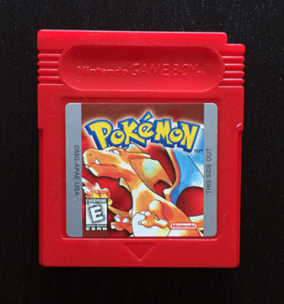

# 🖼️ Image Feature Extraction using Zernike Moments

Welcome to the mini-project focused on **feature extraction and object detection** using **Zernike Moments** — a robust, rotation-invariant method to capture shape features from images. 🎯

---

## 📌 Objective

- Extract meaningful features from object shapes.
- Identify a reference object among multiple distractors based on shape similarity.
- Demonstrate the robustness of Zernike Moments against rotation and distortion.

---

## 🛠️ Technologies Used

- Python 3.8+
- OpenCV
- Mahotas
- Scipy
- Jupyter Notebook (or Google Colab)

---

## 🚀 Project Workflow

1. **Load Images**: Import reference and target images.
2. **Preprocessing**:
   - Grayscale Conversion
   - Gaussian Blur
   - Thresholding
   - Morphological Operations (Dilation & Erosion)
3. **Contour Detection**: Identify object boundaries.
4. **Feature Extraction**:
   - Calculate Zernike Moments for each detected object.
5. **Object Matching**:
   - Use Euclidean Distance to match reference features to target features.
6. **Visualization**:
   - Green bounding box around matched object ✅
   - Red bounding boxes around distractors ❌

---

## 📷 Output Example

| Reference Image | Target Image | Detection Output |
|:----------------:|:------------:|:----------------:|
|  |  |  |


---

## 📚 Installation

Clone the repository:
```bash
git clone https://github.com/AyushAcharya07/Image_Feature_Extraction_Zernike_Moments.git
```
---


### Install the dependencies:
```bash
pip install -r requirements.txt

```

### Run the Jupyter Notebook:

```bash
jupyter notebook main.ipynb
```

---

## ⚡ Challenges Faced: 
1. Selecting an appropriate dynamic radius for different object sizes.

2. Handling distorted or partial shapes.

3. Managing increased computation time at higher Zernike polynomial degrees.
---
## 🚀 Future Improvements: 

1. Integrate machine learning classifiers (like SVM) for better recognition.

2. Extend to real-time video stream detection.

3. Build a simple GUI application for user-friendly object detection.

---

## 📄 License

This project is licensed under the [MIT License](LICENSE).

